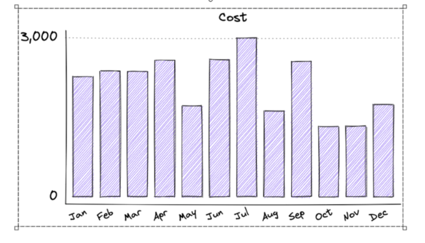

- [Tìm hiểu về công cụ vẽ các mô hình](#tìm-hiểu-về-công-cụ-vẽ-các-mô-hình)
  - [1.Công cụ Draw.io](#1công-cụ-drawio)
    - [1.1. Khái niệm](#11-khái-niệm)
    - [1.2. Ưu điểm của trang web](#12-ưu-điểm-của-trang-web)
    - [1.3 Nhược điểm](#13-nhược-điểm)
    - [1.4 Các bước tạo biểu đồ trên Draw.io](#14-các-bước-tạo-biểu-đồ-trên-drawio)
- [2. Phần mềm Excalidraw](#2-phần-mềm-excalidraw)
  - [2.1. Khái niệm](#21-khái-niệm)
  - [2.2. Một số tính năng làm thêm trên Excalidraw](#22-một-số-tính-năng-làm-thêm-trên-excalidraw)

# Tìm hiểu về công cụ vẽ các mô hình 
## 1.Công cụ Draw.io
### 1.1. Khái niệm 
- Là một trang web cho phép bạn thao tác trực tiếp trên giao diện website và tạo một biểu đồ mang hình dạng của site map hay cơ cấu tổ chức..... một cách nhanh chóng dễ dàng 
- Địa chỉ của trang 
**https://www.draw.io**
### 1.2. Ưu điểm của trang web 
- Có thể lựa chọn một số khung đã được tạo sẵn giúp rút ngắn thời gian 
- Tạo khung khá thoải mái( tùy ý co dãn )
- Điều chỉnh linh hoạt 
- Xuất, nhập file dễ dàng 
### 1.3 Nhược điểm 
- Khó căn khung cho biểu đồ 
- Không thể reponsive được (không có dạng hiển thị khác trên màn hình mobile)
- Quản lý các thành phần chưa tốt lắm nên việc chuyển đổi màu sắc cùng lúc nhiều khối phải mất nhiều thời gian để chọn nhiều thành phần 
- Xuất dưới dạng  như xml,html nhưng lại bị mã hóa 
### 1.4 Các bước tạo biểu đồ trên Draw.io 
- #### Bước 1 Truy cập vào trang web [Draw.io](https://www.draw.io/)
Sau khi truy cập trang web sẽ hỏi bạn tạo muốn tạo một biểu đồ hay mở lại biểu đồ mới mà bạn đã tạo trước đó , ở đây tôi sẽ tạo một biểu đồ mới để tiện cho việc hướng dẫn


- #### Bước 2 Sau khi chọn "tạo biểu đồ mới" trang web sẽ đưa ra câu hỏi về loại biểu đồ bạn muốn, ở đây bạn có thể lựa chọn các loại biểu đồ có sẵn của trang web hoặc tạo một biểu đồ trống để làm từ đầu.


Ngoài ra bạn cũng có thể nhập luôn tên và định dạng cho biểu đồ cần tạo từ đây ví dụ như: bieudoabc.html

- #### Bước 3 Tạo biểu đồ bằng cách dùng công cụ của website 
   - Trước khi bắt đầu tạo khối cho biểu đồ thì bạn cần chỉnh lại "Kích thước giấy" trước khi vẽ (vì đây là trang web thiết kế dành chủ yếu cho việc in ấn và hiển thị trên giấy chứ không phải dành cho website), do đó bạn nên quy đổi giá trị từ "pt" sang "px" để dễ thiết kế.


   - Ở đây có 1 trick để do kích thước thiết kế được chính xác bằng cách ấn vào chữ **Ảnh** cạnh nền và import vào đó 1 bức ảnh nhỏ có chiều dài (tính bằng px) như mong muốn, dựa vào nó bạn có thể chỉnh lại kích thước của khung giấy cho phù hợp


-  Sau khi có được kích thước như ý ,việc tiếp theo bạn cần làm là sử dụng các công cụ có sẵn của website để tạo ra biểu đồ (hình dưới)


-  Phía trên đầu là khung điều chỉnh cơ bản như zoom to nhỏ ,xóa
- Phía bên tay trái của màn hình là khối hình được tạo sẵn, bạn chỉ việc, kéo vào và căn chỉnh cho đúng với ý muốn của mình .Bạn có thể mở các lớp khá để chọn hình dáng khung mà mình mong muốn 
- Giữa trang là khu vực vẽ chính : Để tạo liên kết giữa 2 khối chữ nhật ta cần 1 đường kẻ để nối chúng với nhau. Bạn chỉ việc chọn vào hình mũi tên ở khung phía bên trái thì sẽ được tự động thêm vào khung hình
- Tiếp đó bạn chọn vào đường mũi tên vừa hiển thị nó sẽ hiển thị các khớp (điểm) nối màu xanh da trời, nhấp vào ô màu xanh phía đuôi và kéo vào khung xuất phát "Nhập biểu đồ". Làm tương tự với khung thành phần 1 và ta sẽ có 1 đường nối liên kết 2 khung với nhau.

_"Chú ý khi bạn kéo khớp nối màu xanh vào khung thì khung sẽ hiển thị các dấu x là vị trí bắt khớp của khung hình đó cùng với màu xanh lá cây tròn to để bạn dễ bắt khớp vị trí mong muốn"_

- Phía bên tay phải của màn hình là khung điều chỉnh các thuộc tính của khung hình, text và các đường nối (line) giữa các khung đó từ màu sắc đến hình dáng hiển thị của chúng


- Để sử dụng các thành phần con trong biểu đồ được dễ dàng hơn bạn cần tới một công cụ quản lí đó là "Lớp". Để bật thành phần này bạn có thể chọn vào khung phía trên màn hình (chỗ 3 ô hình lồng nhau) hoặc ấn tổ hợp phím **Ctrl + Shift + L**, khi đó màn hính sẽ hiển thị thêm 1 khung có tên là lớp.Bạn có thể thêm các lớp khác nhau (dấu cộng) để dễ quản lí hoặc add 1 khung thành phần nào đó vào lớp tương ứng (dấu mũi tên đi vào khung vuông)


- #### Bước 4 Lưu biểu đồ bạn vừa tạo

Bạn ấn vào "tập tin" và chọn "Lưu" **(hoặc ấn Ctrl + S)** lựa chọn này sẽ tự lưu trực tiếp file của bạn mà ko chỉnh sửa gì cả.
Ngoài ra bạn có thể lựa chọn "Lưu dưới dạng" **(hoặc ấn Ctrl + Shift + S)**, ở đây bạn có thể chỉnh sửa tiêu đề của biểu đồ và lựa chọn các vị trí lưu lại cho biểu đồ của mình
*Chú ý : Ở dạng save này bạn có thể điều chỉnh lại tên của tập tin cũng như định dạng của nó*


 Ngoài ra còn 1 cách khác để xuất ra dạng Html và các dạng khác đó là **xuất đưới dạng** ( ở đây có rất nhiều dạng cho bạn lựa chọn )

 

  -  #### Bước 5 Hiển thị trên trang Web 
Có nhiều người sẽ nghĩ chỉ việc cop code từ file vừa rồi và đưa vào trang web là được nhưng như đã nêu ở phần nhược điểm là trang web này sẽ mã hóa khối biểu đồ bạn vừa tạo và có hiển thị như sau trên trang web


 
 - Khi hiển thị sẽ có 1 bao khung, ấn vào sẽ như pop up bật ra hiển thị toàn hỉnh ảnh của biểu đồ mình vừa vẽ. Đối với những trang web không quan tâm lắm tới hiển thị này thì có thể để vậy tuy nhiên có những trang web không muốn cái khung hiển thị đó thì làm sao ?
 - Để có thể lọc ra được thành phần không bị bao khung thì cần bạn làm thêm 1 bước nữa :

Bạn mở file html (biểu đồ ) bạn vừa tạo trên 1 trình duyệt web bất kì (ở đây tôi chọn chrome)

Chỉ vào trong khung (cụ thể là thành phần tổng) ấn chuột phải chọn kiểm tra **(hoặc ấn Ctrl + Shift + I)**

Ở khung vừa mới hiển thị phía dưới, bạn kéo thanh cuộn lên trên và chọn dòng có chữ SVG ở đầu (ảnh dưới).


Tiếp đó đóng hình tam giác lại (trước chữ SVG) và chuột phải chọn "copy" -> "copyouterHTML" sau đó "paste" nội dung vừa mới copy vào 1 file html mới hoặc trực tiếp vào file nào bạn cần và save lại file đó, Fomat lại định dạng hiển thị của file html cho dễ nhìn nếu cần.

Sau khi hoàn tất các bước trên thì bạn đã có 1 biểu đồ hiển thị trên website như ý muốn của mình

# 2. Phần mềm Excalidraw 
## 2.1. Khái niệm 
Excalidraw là một bảng vẽ ảo (virtual whiteboard) dành cho các công việc phác thảo, đặc biệt hữu dụng trong việc tạo đồ thị, giải thích luồng xử lý. Công cụ này không chỉ hỗ trợ những thao tác cơ bản như vẽ hình đơn giản, thêm chữ, tô màu... mà người dùng còn có thể tuỳ chỉnh nét vẽ. Đặc biệt với lựa chọn Sloppiness là Artist hay Cartoonist, người dùng có thể tạo ra cảm giác "vẽ tay" cho bản vẽ của mình. Còn nếu thích mọi thứ "ngay hàng thẳng lối", Architect sẽ là cấu hình dành cho bạn. À nhân tiện nói về architect, Excalidraw cũng hỗ trợ cả dark mode mà các lập trình viên thường thích nữa nha.

[excalidraw](https://excalidraw.com/)


_hỗ trợ tính năng dark mode_

Bên cạnh việc tự vẽ tay

- Bên cạnh việc tự "vẽ tay" những thứ mình cần, người dùng cũng có thể tận dụng hơn 100 bộ hình ảnh, kí hiệu sẵn có thuộc nhiều đề tài, lĩnh vực khác nhau thông qua tính năng thư viện - Library. Ví dụ như khi cần vẽ kiến trúc hệ thống, bạn có thể sử dụng các bộ kí hiệu về dịch vụ cloud như GCP, Azure, AWS... Hơn nữa, người dùng cũng có thể tự tạo thư viện cho cá nhân mình từ những hình ảnh thường xuyên sử dụng. Bạn có thể xem qua các thư viện của Excalidraw để tìm kiếm "chân ái" của đời mình nha.
[Các thư viện của excalidraw](https://libraries.excalidraw.com/?theme=light&sort=default) 

- Một tính năng nữa hẳn sẽ khiến bạn ngạc nhiên về sự "có tâm" của Excalidraw, đó là khi người dùng copy-paste nội dung từ hai cột của một bảng tính (như từ Excel chẳng hạn), và có một cột là số liệu, thì người dùng có thể lựa chọn hiển thị nội dung đó dưới dạng biểu đồ, rất tinh gọn và đỡ mắc công biết bao nhiêu.



- Và đặc sắc hơn đó là Excalidraw cũng hỗ trợ tính năng Collaboration. Tính năng này cho phép người dùng có thể chia sẻ bảng vẽ của mình với người khác để cùng nhau thao tác. Hơn nữa, **Excalidraw** còn cẩn thận tạo cơ chế mã hoá dữ liệu trên đường truyền để "bảo vệ" nội dung. Để test thử tính năng này, bạn có thể chọn **Collaboration** trên Excalidraw và mời bạn bè của mình cùng vẽ.


Còn nếu muốn tự host một server cho mình, bạn có thể sử dụng thư viện [excalidraw-room](https://github.com/excalidraw/excalidraw-room).
- Là một dự án mã nguồn mở, bạn hoàn toàn có thể "đem Excalidraw về" với website của mình để có thể tuỳ chỉnh và nâng cấp mã nguồn của Excalidraw tuỳ theo nhu cầu. Trong trường hợp đó, bạn đã có sẵn thư viện excalidraw wrap công cụ này:

- Thư viện này giúp chúng ta nhúng Excalidraw một cách dễ dàng thông qua các component có sẵn:
```
import { useState, useEffect } from "react";
export default function IndexPage() {
  const [Comp, setComp] = useState(null);
  useEffect(() => {
  import("@excalidraw/excalidraw").then((comp) => setComp(comp.default));
  }, []);
  return <>{Comp && <Comp />}</>;
}
```
*onChange: khi bảng vẽ thay đổi*
*onCollabButtonClick: khi thực hiện collaboration*
*updateScene + addFiles: khi cập nhật nội dung bảng vẽ bằng tập tin JSON*
*getSceneElements + getFiles + getAppState; khi cần lấy nội dung bảng vẽ*
Ngoài ra, các tính năng tiện ích như export thành tập tin hình ảnh SVG/PNG hay tập tin JSON cũng được hỗ trợ sẵn.
- Tập tin JSON của Excalidraw là danh sách các element được vẽ lên bảng vẽ, cùng các cấu hình của những element đó. Cấu trúc JSON của Excalidraw cũng khá đơn giản như bên dưới:

 ```
{
  "type": "excalidraw",
  "version": 2,
  "source": "http://localhost:3001",
  "elements": [
    {
      "type": "image",
      "version": 254,
      "versionNonce": 1937741759,
      "isDeleted": false,
      "id": "-_Xd5lJQnb6m36LJN9H7g",
      "fillStyle": "hachure",
      "strokeWidth": 1,
      "strokeStyle": "solid",
      "roughness": 1,
      "opacity": 100,
      "angle": 0,
      "x": 719,
      "y": -20,
      "strokeColor": "transparent",
      "backgroundColor": "transparent",
      "width": 48,
      "height": 48,
      "seed": 1858260293,
      "groupIds": [
        "5x-pNSwhl3P8oD_ji-ZGv"
      ],
      "strokeSharpness": "round",
      "boundElements": [],
      "updated": 1656485934254,
      "link": null,
      "status": "pending",
      "fileId": "file_832066996",
      "scale": [
        1,
        1
      ]
    },
    {
        ...
    }
    ...
  ],
  "appState": {
    "gridSize": 20,
    "viewBackgroundColor": "#ffffff"
  },
  "files": {
    "file_832066996": {
      "id": "file_832066996",
      "dataURL": "data:image/svg+xml;base64,PD94bWwgdmVyc2lvb..."
    }
  }
}
```
Bạn hoàn toàn có thể chỉnh sửa tập tin JSON (với các giá trị phù hợp) và import lại vào Excalidraw để thấy sự thay đổi. Sơ lược một số đặc điểm của cấu trúc này:

Một số các type element Excalidraw hỗ trợ: rectangle, diamond, ellipse, line, arrow, freedraw, và image. Các type khác nhau sẽ có thêm các thuộc tính riêng biệt.
Thuộc tính version và versionNonce được Excalidraw sử dụng trong quá trình syncing và merging nội dung khi collaboration.
Thứ tự các element trong mảng elements sẽ quyết định thứ tự render của các element (vị trí trên/dưới giữa các element).
Nội dung của hình ảnh sẽ được lưu trong thuộc tính files (với dataURL là định dạng base64 hoặc URL của image), các element có type image sẽ tham chiếu đến hình ảnh này thông qua thuộc tính fileId.

Còn nếu bạn sắp cần chỉnh sửa source code của Excalidraw thì bên dưới là một số class đáng chú ý trong source code:

*appState.ts:* chứa cấu hình mặc định cho các thuộc tính như *font-family, font-size, sloppiness (roughness)*... Bạn có thể tuỳ chỉnh lại cho phù hợp với mục đích sử dụng. Ví dụ khi cần host Excalidraw dành cho người vẽ kiến trúc hệ thống, bạn sẽ muốn đổi thuộc tính *currentItemEndArrowhead* (đầu mũi tên) thành *triangle*, đổi thuộc tính *currentItemRoughness (sloppiness)* thành 1, và *currentItemFillStyle thành solid.* Như vậy, nét vẽ sẽ trở nên cứng cỏi hơn.
*actionProperties.ts:* chứa các hàm *render component* tuỳ chỉnh trên giao diện *Excalidraw*, cần xem khi bạn muốn thêm nút mới hoặc tuỳ chỉnh UI các nút sẵn có.
*renderElement.ts*: chứa các hàm thực thi thao tác *render element* lên *canvas của Excalidraw*, cần xem khi bạn muốn can thiệp hay thay đổi hành vi render.
*mutateElement.ts*: chứa các hàm để *persist dữ liệu cho element*

## 2.2. Một số tính năng làm thêm trên Excalidraw
- Thêm font size XS - Extra small để làm chú thích cho các icon:

)
